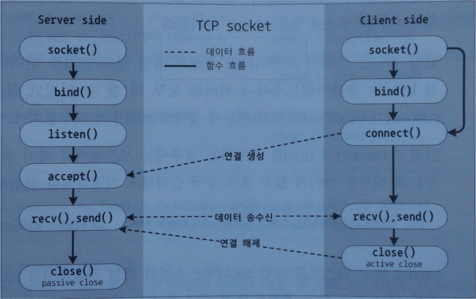
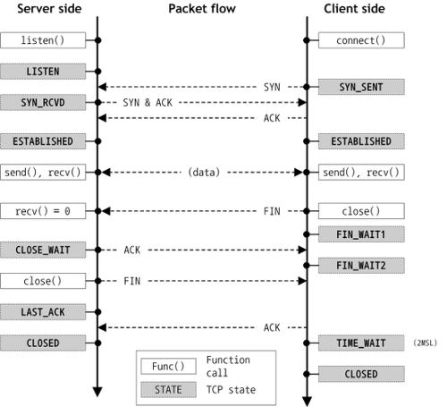

### 6.4 TCP 소켓
#### 6.4.1 관련 함수
- bind : 소켓을 시스템에 부착한다.
- listen : 외부로부터 TCP 연결을 받아들일 수 있도록 접속 연결 큐를 만들고 대기한다.
- connect : listen() 하고 있는 서버측 소켓에 연결한다.
- close : 해당 프로세스내에서 소켓 ID를 닫는다.
- shutdown : 소켓에 EOF를 보내 연결된 모든 소켓을 닫는다.
- recv, read : 소켓으로 부터 데이터를 수신한다.
- write, send : 소켓을 통해 데이터를 송신한다.
- readv : 소켓으로 부터 데이터를 벡터 형태로 수신한다.
- writev : 소켓을 통해 벡터 데이터를 송신한다.

서버나 클라이언트에서 close, shutdown을 호출하면 active close할 수 있다.

- `int bind (int sockfd, const struct sockaddr * addr, socklen_t addrlen)`
	- 외부 인터페이스와 소켓을 연결해준다.
	- 서버, 클라이언트 모두에서 할 수 있지만 connet함수가 bind를 내포하고 있기 때문에 생략하는 경우가 많다.
	- bind함수를 호출할 때 하위 호환성을 위해 sockaddr 구조체를 struct sockaddr* 로 캐스팅해주고 addrlen을 통해 메모리 침범을 방지한다.
	- sockaddr 구조체에서 사용하는 데이터들은 htons 함수를 통해 빅 엔디안으로 수정해줘야 한다.
in_addr_in 역시 빅엔디안으로 저장해야하는데 IP를 얻는 함수들이 에초에 빅 엔디안으로 만들어 주기 때문에 따로 변환하지 않아도 된다.
	- inet_addr함수는 차후 호환성에 문제가 있을 수 있으므로 getaddrinfo함수를 사용하자.

- `int listen(int socket, int backlog)`
	- backlog는 대기 큐의 길이로 보통 500을 넘지 않는 수로 지정한다.
리눅스의 경우 backlog값은 의미가 없고 커널 설정에서 읽어들인다. (net.ipv4.tcp_max_syn_backlog)
몇몇 유닉스의 경우에는 커널 기본값과 backlog값 중 작은 값을 선택하는 경우도 있다.

- `int accept(int socket, struct sockaddr* restrict address, socklen_t *restrict address_len)`
	- address_len 인자에는 접속한 클라이언트의 정보가 담긴다.
address, adress_len 인자를 null로 지정하면 따로 정보가 반환되지 않는다.
	- accept함수가 매번 루프를 돌며 접속을 체크하고 IPv4, IPv6를 모두 호환하기 위해 sockaddr_storage를 사용하는 경우에는 
accept 후 address_len을 다시 초기화 해주어야 한다. sockaddr_storage의 사이즈는 128바이트인데 IPv4를 사용하는 경우에는 
address_len이 16가 되기 때문이다.
	- 클라이언트의 IP, Port표현을 위해 inet_ntoa나 ntohs를 사용하는 것은 구식 코드이며 getnameinfo를 사용하는 것이 좋다.

- `int connect(int sock, const struct sockaddr *address, socklen_t` address_len)
	- connect가 bind를 포함하고 있기 때문에 보통은 bind함수 호출이 생략되지만 클라이언트가 여러개의 ip를 가지고 있는 경우
명시적으로 bind를 호출해주는 경우가 있다. 
내부적으로 bind가 일어나는 작업을 implict binding이라하고 원하는 주소를 지정하는 경우를 explict binding이라고 한다.

-` ssize_t send(int sock, const void *buffer, size_t length, int flags)`
	- send 함수는 전송을 성공하면 전송에 성공한 바이트수를 반환하는데 이때 반환된 함수가 전송한 버퍼의 크기보다 작은으면
모든 데이터가 전송되지 않았음을 의미하므로 재전송 해줘야한다.
	- 상대편 소켓이 연결을 끊었는데 이를 모르고 send를 호출하면 SIGPIPE 시그널이 발생한다. 
하지만 이 시그널에대한 처리를 사용하지 않는다면 따로 이 시그널을 발생시킬 이유가 없기 때문에 MSG_NOSIGNAL flag를 사용해 시그널을 무시하게 한다.
	- 리턴되는 오류 중 EAGAIN, EINTR의 경우는 대부분 재전송을 하고  EPIPE는 연결을 닫고 정리하는데 넌블럭킹 모드에서는 EAGAIN오류 발생시 같은 오류가 계속 반복 될 수 있어 주의해야한다.

- `int recv(int s, void *buf, size_t len, int flags)`
`ssize_t recv(int socket, void *buff, size_t length, int flags)`
	- 수신에 성공하면 수신한 바이트 수를 반환한다.
반환 값이 0이면 상대가 연결 종료를 요구한 것이므로 close를 호출해야한다.

	- TCP는 데이터의 경계를 보존하지 않기 때문에 send를 여러번 호출해도 recv버퍼의 크기가충분하면 한번에 받을 수 있다.
반대로 recv버퍼의 크기가 작으면 한번의 send함수로 보내진 데이터를 여러번에 나눠 받아야 할 수 있다.

- close, shutdown
	- tcp 연결을 닫기 위해 제공되는 함수는 close와 shutdown의 두가지가 존재하는데 연결을 닫는 범위가 다르다 
		- close : 연결된 소켓의 파일 기술자 ID만 닫는다.
		만일 같은 소켓을 여러개의 프로세스가 공유하고 있다면 공유하고 있는 모든 프로세스에서 close를 호출해야 실제로 연결이 끊어진다.
		- shutdown : 모든 연결을 즉시 닫는다.
		다른 프로세스에서 recv를 하고 있었다면 EOF가 전달되어 0이 반환되고 send를 하고 있었다면 SIGPIPE 시그널이 발생한다.
		따라서 shutdown이 호출되면 다른 프로세스에서는 close를 호출해 파일 기술자를 다는 작업을 해야한다.
			- shutdown 함수를 호출 할 때는 어떤 채널을 닫을 지 선택할 수 있다.
				- SHUT_RD : 읽기 채널 닫기
				- SHUT_WR : 쓰기 채널 닫기
				- SHUT_RDWR : 즉시 닫기
			- 소켓에는 송/수신버퍼가 따로 있는데 채널을 닫는다는 것은 각각의 버퍼를 제거하는 것과 같다.
#### 6.4.2 TCP 상태이전

- 일반적으로 TCP 에서 사용하는 연결 상태는 LISTEN, SYN_SENT, SYN_RCVD, ESTABLISHED, CLOSE_WAIT, FIN_WAIT1, FIN_WAIT2, LASK_ACK, TIME_WAIT, CLOSED 등 여러가지가 있다.
	 - LISTEN : 접속 가능한 소켓
- TCP는 
	- 패킷을 받으면 받은 패킷에 대한 응답으로 ACK패킷을 보내고 
	- 받은 패킷이 제어 패킷이면 동일한 제어 패킷을 보낸다.
		- three-way handshaking
			- SYN : 클라이언트가 서버로 연결시도
			- SYN/ACK : 클라의 연결시도에 대한 서버의 응답
			- ACK : 서버의 응답에 대한 클라이언트의 응답
	- 연결을 해제하는 FIN플래그에도 동일하게 적용됨
		- 연결을 해제하는 경우에는 FIN을 받은 후 리소스를 정리하는 과정이 필요하기 때문에 연결을 할 때 처럼 SYN/ACK를 한번에 보내지 않고
		FIN/ACK로 나눠 전송한다. (FIN을 받으면 recv함수에 0이 반환되고 close함수를 호출하면 ACK가 전달된다.)
	- 연결을 해제할 때  TIME_WAIT 상태를 2*MSL 만큼 유지하는데 그 이유는 close 이후 지연/유실됐던 패킷이 오는 것을 처리하기 위함이다.
	유실된 패킷을 제대로 처리하지 않으면 송신측에서 패킷 전달에 실패한것으로 인식해 불필요한 재전송을 해야할 수 있기 때문이다.

