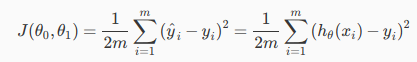

# Week1
## 1 Review
### 1.1 Supervised Learning
데이터 셋과 데이터 셋에 대한 정확한 결과 값이 이미 주어진 상태에서 input 값과 output 값의 관계를 찾는 방법
>**Regression (회귀)**
>연속 적인 결과 값을 예측하는 방법
>
>*예 : 집 크기에 따른 집값 예측하기*
>
>**Classification**
>이산적인 결과값을 예측하는 방법
>정확히 두가지로만 나눠지지 않고 여러가지 타입의 결과가 있을 수 있음
>
> *예 : 종양이 양성인지 음성인지 예측하기*

### 1.2 Unsupervised Learning
변수가 어떤 영향을 줄지 모르는 상태에서 결과를 도출하고 예측하지 못한 문제에 다가가 수 있음

>**Clustering**
>
>**Non-clustering**

 
## 2 Model and Cost Function
### 2.1 Model Representation
기호설명
> |||
> |-|-|
>|m|데이터 셋(학습 셋)의 수|
>|x|입력 값 (feature)|
>|y|출력 값 or 예측하려는 목표 변수|
>|(x, y)|하나의 학습 예제|
>|(x^(i)^, y^(i)^)|하나의 i번째 학습 예제|
>|X|입력공간|
>|Y|출력공간|
>|h(hypothesis)|가설|

** Regression Problem (회귀 문제)**
 >우리가 예측하는 값이 연속적일 때
 
** Classification Problem**
 >우리가 예측하는 결과 값이 몇 개의 불연속적인 값일 때

### 2.2 Cost Function
가설 함수(h~(x)~)의 정확성을 측정하는 함수
>
> 예측한 결과값과 실제 결과 값이 차이를 제곱한 평균값의 절반

Squared error function 이나 Mean squared error로 부르기도함