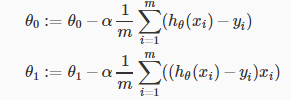

<!doctype html>
<html>
<head>
    <meta charset="UTF-8">
    <link rel="stylesheet" media="all" href="normalize.css">
    <link rel="stylesheet" media="all" href="core.css">
    <link rel="stylesheet" media="all" href="style.css">
    
</head>
<body data-document>&nbsp;</body>
</html>

# Week1
## 1. Review
### 1.1. Supervised Learning
데이터 셋과 데이터 셋에 대한 정확한 결과 값이 이미 주어진 상태에서 input 값과 output 값의 관계를 찾는 방법
>**Regression (회귀)**
>연속 적인 결과 값을 예측하는 방법
>
>*예 : 집 크기에 따른 집값 예측하기*
>
>**Classification**
>
>이산적인 결과값을 예측하는 방법
>정확히 두가지로만 나눠지지 않고 여러가지 타입의 결과가 있을 수 있음
>
> *예 : 종양이 양성인지 음성인지 예측하기*

### 1.2. Unsupervised Learning
변수가 어떤 영향을 줄지 모르는 상태에서 결과를 도출하고 예측하지 못한 문제에 다가가 수 있음

>**Clustering**
>
>**Non-clustering**

 
## 2. Model and Cost Function
### 2.1. Model Representation
기호설명
>|||
>|-|-|
>|m|데이터 셋(학습 셋)의 수|
>|x|입력 값 (feature)|
>|y|출력 값 or 예측하려는 목표 변수|
>|(x, y)|하나의 학습 예제|
>|(x^(i)^, y^(i)^)|하나의 i번째 학습 예제|
>|X|입력공간|
>|Y|출력공간|
>|h(hypothesis)|가설|

**Regression Problem (회귀 문제)**
 >우리가 예측하는 값이 연속적일 때

**Classification Problem**
 >우리가 예측하는 결과 값이 몇 개의 불연속적인 값일 때

### 2.2. Cost Function
가설 함수(h~(x)~)의 정확성을 측정하는 함수
>
> 예측한 결과값과 실제 결과 값이 차이를 제곱한 평균값의 절반

Squared error function 이나 Mean squared error로 부르기도함

## 3. Parameter Learning

### 3.1. Gradient Descent (기울기 하강)

를 구할 때 각각의 파라미터는 한번에 변화한다.
>θ~0~이 θ~1~에 영향을 미치지 않는다는 의미

비용 함수의 미분계수는 최저점과의 상대 위치에 따라 더 작은 때는 음수, 더 클때는 양수로 나오기 때문에 미분계수의 부호와 상관없이 항상 최저점을 향해 근접하게 된다.

α(step size)가 고정 값이라도 미분계수가 최저점에 가까워지며 0에 수렴하기 때문에 자연스럽게 이동 거리가 줄어들며 점점 최저점에 가까워지게 된다.

### 3.2. Gradient Descent for Linear Regression (선형회귀의 기울기 하강)
기울기 하강이 선형 회귀에 적용될 때 아래 새 형태의 기울기 하강 방정식을 사용할 수 있다.

이 방법은 매 스텝을 나아갈 때마다 모든 학습셋을 계산하기 때문에 **batch gradient descent** 라고 부른다.

선형 회귀의 비용함수 그래프는 볼록한 형태기 때문에 항상 전역적인 최소 값을 찾을 수 있다.

## 4. Linear Algebra

### 4.1. Matrices and Vectors
$\begin{bmatrix} a & b & c \newline d & e & f \newline g & h & i \newline j & k & l\end{bmatrix}$
위 행렬은 4개의 행과 3개의 열을 가진 4 x 3 행렬이다.
A~ij~는 A행렬의 i번째 행 j번째 열의 값을 나타낸다.

$$\begin{bmatrix} w \newline x \newline y \newline z \end{bmatrix}$$
벡터는 위처럼 열이 1개 뿐인 행렬의 부분집합이다.
v~i~는 i번째 백터의 i 번째 열 값을 나타낸다.
일반 적은로 벡터는 1 부터 인덱싱 되지만 프로그래밍에서는 0부터 인덱싱된다.

일반적으로 행렬은 대문자, 벡터는 소문자로 표현된다.
$\mathbb{R}$$ 은 실수 집합을 의미하며 $$\mathbb{R}$^n^은 실수의 n차원 벡터를 의미한다.

